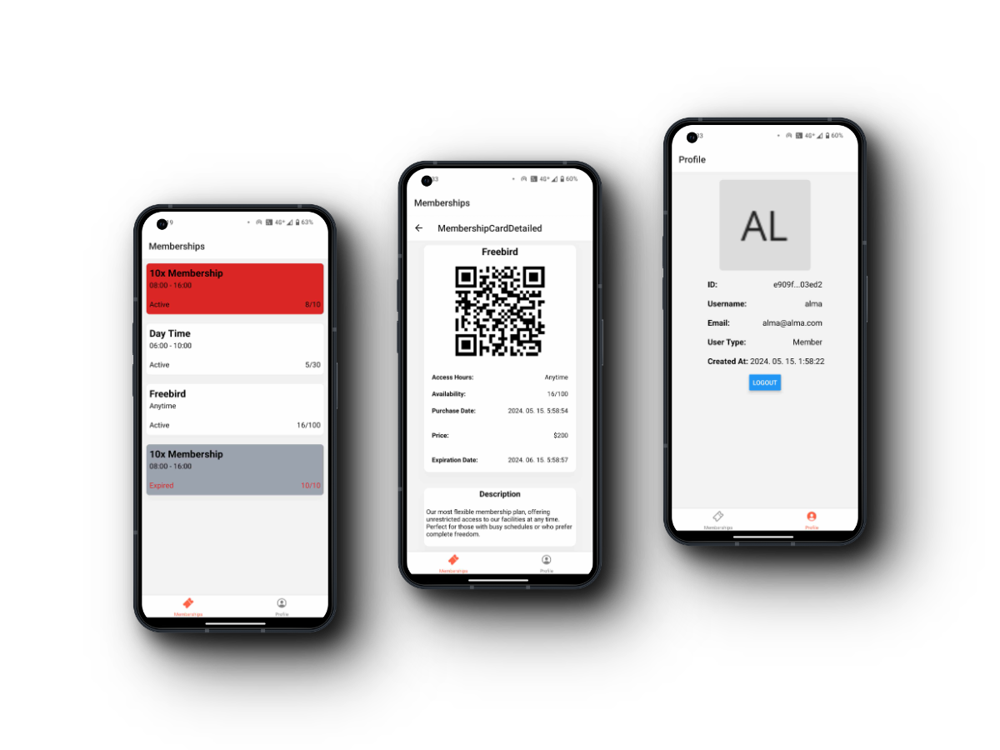
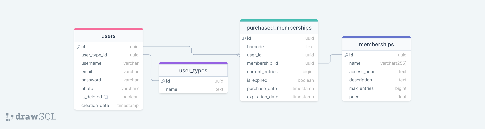

<div align=center>
    
</div>

# FitCheck

A Fitness/Gym check-in application made with React Native (TypeScript + NativeWind), ASP .NET and PostgreSQL.
This repository is meant to be a source of inspiration and a starting point for developers looking to create powerful, user-friendly fitness check-in application.

<div align=center>
    
</div>

## Roadmap

- [x] implemented user functionalities
  - [x] login, register, logout
  - [x] see profile
  - [x] see memberships and its details
- [x] implemented admin screens
  - [x] login, register (by default registration creates member user, it needs to be elevated manually to admin), logout
  - [x] see and delete users
  - [x] search for a user
  - [x] see, create and delete membership purchases
  - [x] scan memberships to check in
  - [ ] edit memberships and membership purchases

# Setup

## Setting up the database and the backend

### Database

You can create a PostgreSQL container with the following example line:

```console
docker run --name postgresql-container -e POSTGRES_PASSWORD=root -p 5469:5432 -d postgres
```

This will create a postgres db with:

- root user: postgres
- root passwd: root
- port: 5469

### API DB migration (if it didn't migrate automatically)

```console
# Get in the api directory
cd api

# Run migrations
dotnet ef database update --context DatabaseContext

# or

Update-Database -Context DatabaseContext
```

### Database structure



### NOTE: For API to work properly you will need to create a [devtunnel](https://youtu.be/kdaHwOkQf7c?si=8L21NrQ4Wrc9WCn9), and replace the api `baseUrl` in the [apiContext.tsx](./app/contexts/apiContext.tsx)

After setting up everything start the api via VisualStudio.

## Setting up the application

```console
# Get in the project directory
cd app

# Install npm dependencies
npm install

# Run the project via
npm run start
# or
npm run android #(it was tested on android only)
# or
npm run ios

# if for some reason it fails to connect use
npm run tunnel
```
